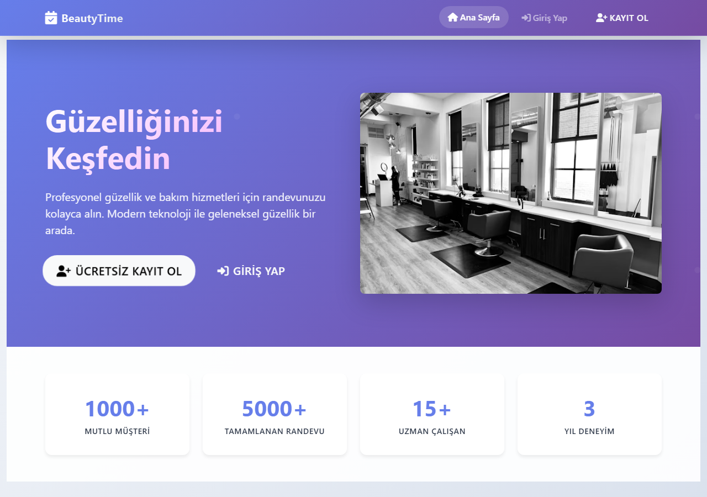
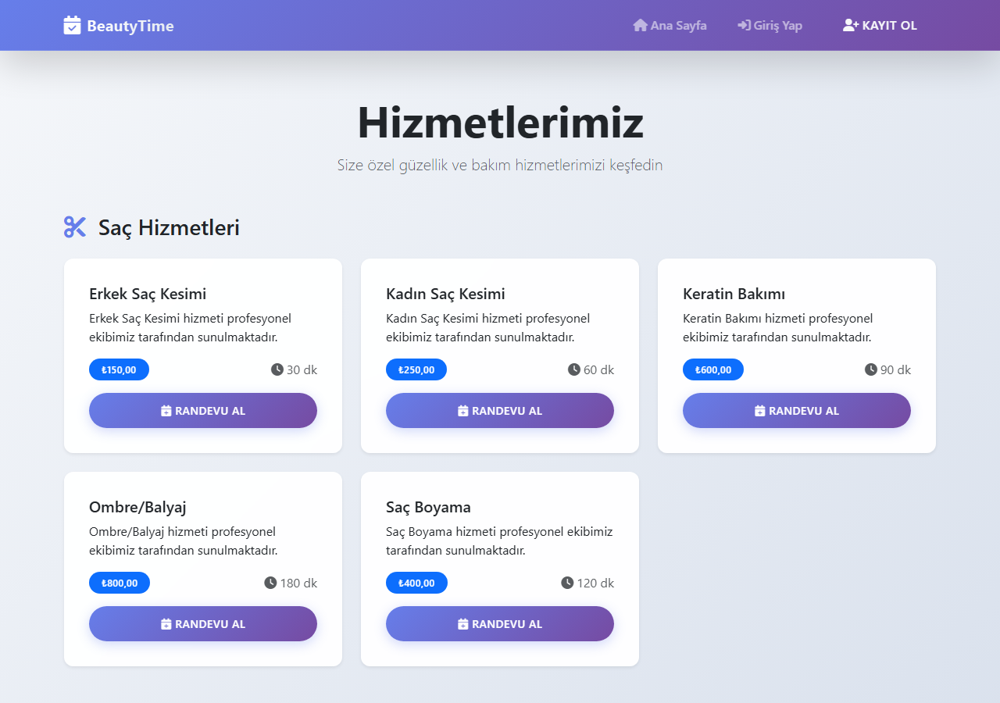

# BeautyTime – Online Appointment System


An online booking system for a beauty salon, built with **Django**. Customers browse services and staff, pick a free time slot and manage their bookings; staff members manage the day's appointments from their own panel.

| Home | Services |
|---|---|
|  |  |

## Features

**Customers**
- Sign up, log in, password reset and profile management
- Browse services by category with price and duration
- Book an appointment: choose a service, a staff member and one of the free time slots
- Reschedule or cancel (up to 2 hours before), leave a review after the visit
- In-app notifications and a personal dashboard

**Staff and admin**
- Staff dashboard with today's and upcoming appointments
- Change appointment status (confirmed, in progress, completed, no-show); every change is kept in a status history
- Full Django admin for services, staff, working hours and FAQs

**Booking rules**
- Each employee has working hours per weekday
- Overlapping bookings for the same employee are rejected
- Appointments in the past or outside working hours are rejected
- End time and price are filled in from the service automatically

**JSON endpoints** used by the booking form: services, employees, available time slots, calendar events and unread notification count.

## Tech

- Django 5, Bootstrap 5, vanilla JavaScript
- SQLite by default, Microsoft SQL Server supported through `mssql-django`
- Optional SMS notifications through Twilio
- Django test suite covering booking rules, access control and pages

## Getting started

```bash
python -m venv .venv
source .venv/bin/activate          # Windows: .venv\Scripts\activate
pip install -r requirements.txt
python manage.py migrate
python load_initial_data.py        # sample services, staff, working hours, FAQ
python create_test_users.py        # demo / demo123, staff / staff123
python manage.py runserver
```

Open http://127.0.0.1:8000.

### Configuration

| Variable | Default | Purpose |
|---|---|---|
| `DJANGO_SECRET_KEY` | development key | Set a real secret in production |
| `DJANGO_DEBUG` | `True` | Turn off in production |
| `DJANGO_ALLOWED_HOSTS` | `localhost,127.0.0.1` | Comma separated |
| `DB_ENGINE` | SQLite | Set to `mssql` to use SQL Server |
| `DB_HOST`, `DB_NAME`, `DB_USER`, `DB_PASSWORD` | | SQL Server connection |

For SQL Server, install the extra packages with `pip install -r requirements-optional.txt`.

## Tests

```bash
python manage.py test
```

## Project structure

```
appointments/
├── models.py              # Service, Employee, Appointment, Review, Notification...
├── views.py               # Pages and JSON endpoints
├── forms.py
├── utils.py               # Time slot generation, notifications, reports
├── decorators.py          # Access control helpers
├── context_processors.py
├── templates/
└── tests.py
randevu_sistemi/           # Project settings and URLs
load_initial_data.py       # Sample data
create_test_users.py       # Demo accounts
```

## License

[MIT](LICENSE)
